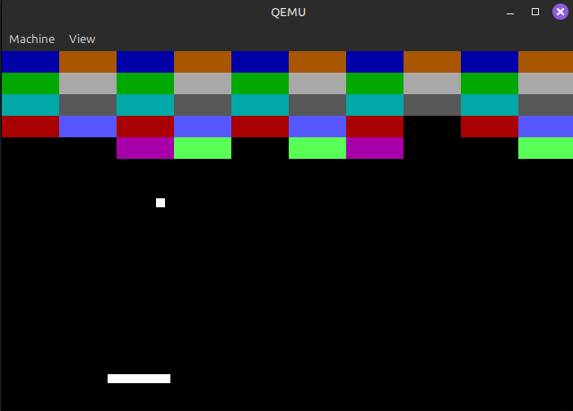

# Breakout in a bootsector

A clone of breakout that can fit entirely within the first 512 bytes of the bootsector. Can be considered a bootloader which can only run breakout.
Written for x86 and uses nasm for assembly.



# Features

* A game that fits into the a bootloader.
* Breakout gameplay with breaking bricks and bouncing ball
* Ball reset - moving the ball before shooting it

# Notes

Although the game does achieve its goal, i run out of memory and couldn't implement certain things such as:
* Lives system
* Game restart
* Victory screen
As well as there are some issues with how collision is handled because the ball is assumed to be 1 pixel in size for a lot of the collision checks to due to space limitations

# Running 
This needs to be assembled to be run, which can be done using provided makefile by running `make` in the root folder of the project.
```sh
git clone https://github.com/MetalPizzaCat/bootsector-pong.git
cd bootsector-pong
make
```

This can then be used with [qemu](https://www.qemu.org/) or anything similar to be run. 
Full example(excluding installation of tools) would be:
```sh
git clone https://github.com/MetalPizzaCat/bootsector-pong.git
cd bootsector-pong
make run

# Hex dump of the game
```
00000000  b8 13 00 cd 10 b8 00 a0  8e c0 b9 05 00 be 9a 7d  |...............}|
00000010  51 b9 0a 00 88 0c 46 e2  fb 59 e2 f4 bf 00 fa 26  |Q.....F..Y.....&|
00000020  c6 05 00 4f 75 f9 8b 1e  cc 7d e4 60 3c 39 74 0a  |...Ou....}.`<9t.|
00000030  3c 1e 74 12 3c 20 74 1a  eb 23 c6 06 d3 7d ff c6  |<.t.< t..#...}..|
00000040  06 d4 7d 01 eb 17 83 fb  01 7e 12 83 2e cc 7d 02  |..}......~....}.|
00000050  eb 0b 81 fb 1d 01 7d 05  83 06 cc 7d 02 89 d8 bb  |......}....}....|
00000060  b4 00 b2 0f b9 23 05 e8  11 01 8a 16 d4 7d 84 d2  |.....#.......}..|
00000070  75 0e c6 06 d0 7d aa a1  cc 7d 83 c0 0f a3 ce 7d  |u....}...}.....}|
00000080  a1 ce 7d 8a 1e d0 7d a3  78 7d 88 1e 7a 7d 75 02  |..}...}.x}..z}u.|
00000090  eb 37 8b 0e cc 7d 39 c8  7c 15 80 fb b4 7c 10 83  |.7...}9.|....|..|
000000a0  c1 23 39 c8 7f 09 80 fb  b9 7f 04 f6 1e d3 7d 3d  |.#9...........}=|
000000b0  3b 01 7d 04 85 c0 75 04  f7 1e d1 7d 80 fb c8 73  |;.}...u....}...s|
000000c0  58 84 db 75 04 f6 1e d3  7d 30 ff b9 05 05 b2 0f  |X..u....}0......|
000000d0  e8 a8 00 a1 d1 7d 01 06  ce 7d a0 d3 7d 00 06 d0  |.....}...}..}...|
000000e0  7d be 9a 7d b9 0a 00 51  49 6b c1 20 b9 05 00 51  |}..}...QIk. ...Q|
000000f0  49 6b d9 0c 8a 14 84 d2  74 09 b9 20 0c e8 7b 00  |Ik......t.. ..{.|
00000100  e8 1d 00 46 59 e2 e8 59  e2 dd b4 86 b9 00 00 ba  |...FY..Y........|
00000110  00 20 cd 15 e9 05 ff eb  fe c6 06 d4 7d 00 eb ea  |. ..........}...|
00000120  8b 16 ce 7d 8a 0e d0 7d  89 c7 83 c7 20 88 df 80  |...}...}.... ...|
00000130  c7 0c 39 c2 72 1e 39 fa  77 1a 38 1e 7a 7d 77 04  |..9.r.9.w.8.z}w.|
00000140  38 d9 73 0a 38 3e 7a 7d  72 0a 38 f9 77 06 f6 1e  |8.s.8>z}r.8.w...|
00000150  d3 7d eb 20 38 d9 72 1f  38 f9 77 1b 39 06 78 7d  |.}. 8.r.8.w.9.x}|
00000160  77 04 39 c2 73 0a 39 3e  78 7d 72 0b 39 fa 77 07  |w.9.s.9>x}r.9.w.|
00000170  f7 1e d1 7d c6 04 00 c3  00 00 00 88 ce 89 df 69  |...}...........i|
00000180  ff 40 01 01 c7 88 f1 57  26 88 15 47 fe c9 75 f8  |.@.....W&..G..u.|
00000190  5f 81 c7 40 01 fe cd 75  ec c3 00 00 00 00 00 00  |_..@...u........|
000001a0  00 00 00 00 00 00 00 00  00 00 00 00 00 00 00 00  |................|
*
000001c0  00 00 00 00 00 00 00 00  00 00 00 00 8f 00 9e 00  |................|
000001d0  aa 01 00 ff 00 4f 4f 4f  4f 4f 4f 4f 4f 4f 4f 4f  |.....OOOOOOOOOOO|
000001e0  4f 4f 4f 4f 4f 4f 4f 4f  4f 4f 4f 4f 4f 4f 4f 4f  |OOOOOOOOOOOOOOOO|
000001f0  4f 4f 4f 4f 4f 4f 4f 4f  4f 4f 4f 4f 4f 4f 55 aa  |OOOOOOOOOOOOOOU.|
00000200

```